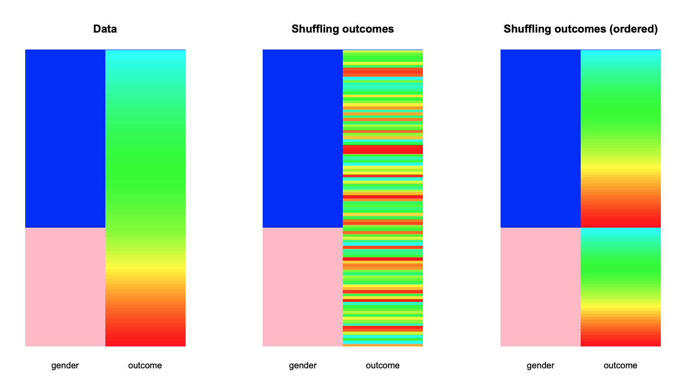

```{r, setup, echo=FALSE, warning = FALSE, message = FALSE, results = 'hide'}
library(boot)
library(knitr)
library(kableExtra)
library(BoutrosLab.plotting.general)

set.seed(13)

knitr::opts_chunk$set(echo = FALSE, warning = FALSE, message = FALSE, fig.align = 'center', out.width = '90%', fig.pos = 'H');

# CB Palette like ESL
cbPalette <- c(
  "#999999", "#E69F00", "#56B4E9", "#009E73",
  "#F0E442", "#0072B2", "#D55E00", "#CC79A7")
```

## Overview
  - Resampling methods generally fall into one of 3 categories
  1. Estimating the uncertainty of an estimator (bootstrapping, jackknife)
  2. Performing significance tests by permuting data (permutation/randomization tests)
  3. Validating models (bootstrapping, cross-validation)
  - Resampling can be done with replacement or without replacement, depending on the purpose of the resampling method.


## Bootstrapping Overview
> "The population is to the sample as the sample is to the bootstrap samples." (Fox 2008)

  - The basic idea is that we resample, with replacement, from our sample and use the distribution of those resamples to compute the standard error and confidence intervals.


## Random Variable
  - A random variable is a mapping (a function) $X : \Omega \to \mathbb R$ that assigns a real number $X(\omega)$ to each outcome $\omega$.
  - We almost never write $X(\Omega)$ but simply write $X$
  - Example: Flip a coin and let $X$ be the number of heads shown
  - The sample space is $\Omega = \{\{ H, H\}, \{ H, T\}, \{ T, H\}, \{T, T\} \}$

```{r}
coin.flip <- data.frame(coin1 = c('H', 'H', 'T', 'T'), coin2 = c('H', 'T', 'H', 'T'))
coin.flip$numHeads <- rowSums(coin.flip == 'H')
kable(coin.flip, col.names = c('coin 1', 'coin 2', 'Number of heads'), row.names = FALSE)
```  
  
## Random Variable - Dice Example
  - The sample space is $\Omega = \{\{ 1, 1\}, \{ 1, 2\}, \{ 2, 1\}, \ldots \}$
  - $X(\{3,4\}) = 7$

```{r}
dice <- data.frame(die1 = unlist(lapply(1:6, rep, times = 6)), die2 = rep(1:6, 6))
dice$sum <- rowSums(dice)
dice <- dice[order(dice$sum), ]
kable(head(dice), row.names = FALSE, col.names = c('die 1', 'die 2', 'Sum of dice'))
```

## Cumulative Distribution Function
  For a random variable $X$, the **cumulative distribution function** (CDF), $F_X : \mathbb R \to [0,1]$ is
  $$
  F_X(x) = P(X \leq x)
  $$

## Notation
  - If $X \sim F$ then we say that $X$ has distribution $F$.
  - For example, $X \sim \exp(\lambda)$ means that $X$ is exponentially distributed with rate $\lambda$ and
  $$
  F(x) = \begin{cases}
    1 - e^{-\lambda x} & x \geq 0\\
    0 & x < 0
  \end{cases}
  $$

## CDF - Normal
```{r}
x <- seq(-4, 4, length.out= 100)
plot(x, pnorm(x), type = "l", ylab = "F(x)", main = "Normal distribution CDF", las = 1)
lines(x, pnorm(x, sd = 1/2), lty = 2)
lines(x, pnorm(x, sd = 2), lty = 3)
legend(2, 0.4,
       legend=c(
         expression(paste(sigma, "=", 1)),
         expression(paste(sigma, "=", 0.5)),
          expression(paste(sigma, "=", 2))),
       lty=1:3, cex=0.8)
```

## Empirical Distribution Function
  - Let $X_1, \ldots, X_n \sim F$ be iid random variables
  - Note that this means that $X$ has a distribution function $F$.
  - We can estimate $F$ from the data by using the empirical distribution function $\hat{F}_n$.
  - This distribution $\hat{F}_n$ puts probability of 1/n on each data point

## Example - Normal Distribution
```{r}
set.seed(10)
norm.sample <- rnorm(100)
hist(norm.sample)
```

## Example - Normal (E)CDF
```{r}
N <- c(15, 200)
set.seed(13)
x <- rnorm(N[1])
x.range <- seq(-3, 3, length.out = 1000)
x.F <- pnorm(x.range)
x.ecdf <- ecdf(x)

par(mfrow=c(1,2), mai = c(1, 0.2, 0.5, 0), oma = c(0, 1.2, 0.5, 0.5), las = 1)
plot(ecdf(x), verticals = TRUE, xlim = c(-3, 3), main = '')
rug(x)
lines(x.range, x.F, lty=2)
axis(side = 2, seq(0, 1, by = 0.2))

x <- rnorm(N[2])
x.range <- seq(-3, 3, length.out = 1000)
x.F <- pnorm(x.range)
x.ecdf <- ecdf(x)
plot(ecdf(x), verticals = TRUE, xlim = c(-3, 3), ylab = '', yaxt="n", main = '')
rug(x)
lines(x.range, x.F, lty=2)
title(sprintf('(E)CDF of Normal Distribution n = %d, n = %d', N[1], N[2]), outer = TRUE, line = -1)
```

## Sampling Distribution
  - Let $X_1, \ldots, X_n$  be iid random variables
  - A function of the data is called a **statistic**
  - The mean of these random variables is an example of a statistic
  $$
  \overline{X}_n = \frac{1}{n} \sum_{i = 1}^n X_i
  $$
  - $\overline{X}_n$ is itself a random variable, and thus has a distribution (called the sampling distribution of the statistic).
  - Example: If $X_1, \ldots, X_n \sim N(\mu,\sigma)$ then $\overline{X}_n \sim N \left(\mu, \frac{\sigma}{\sqrt{n}} \right)$

## Statistical Inference
  - Given a sample $X_1, \ldots, X_n \sim F$ we want to infer the distribution $F$.
  - We approximate $F$ using a statistical model, which is a set of distributions
    - Parametric models use a set of distributions that can be parameterized by a finite set of parameters.
    - Example: Two-parameter model for a set of Gaussians
    - Non-parametric models cannot be parameterized by a finite set of parameters

## Example
  - Say we have a sample of iid random variables $X_1, \ldots, X_n$.
  - Computing the variance (and confidence intervals) of the mean is relatively easy.
  - What about some arbitrary statistic: $T_n = g(X_1, \ldots, X_n)$?
    - Option 1: Do some possibly complicated mathematics.
    - Option 2: Bootstrap

## Bootstrap
> "The population is to the sample as the sample is to the bootstrap samples." (Fox 2008)

  1. Compute $T_n = g(X_1, \ldots, X_n)$, our statistic of interest.
  2. Draw a sample $X_1^*, \ldots, X_n^* \sim \hat{F}_n$
    - All this means is to sample $n$ times with replacement from the original data $X_1, \ldots, X_n$.
  3. Compute our statistic of interest $T_n^* = g(X_1^*, \ldots, X_n^*)$
  4. Repeat $B$ times, to get $T_{n,1}^*, \ldots, T_{n,B}^*$
  5. Compute the variance of $T_{n,1}^*, \ldots, T_{n,B}^*$ to get $v_{\text{boot}}$, and standard error $\hat{\text{se}}_{\text{boot}} = \sqrt{v_{\text{boot}}}$
  
## Bootstrap
  - Bootstraping does not improve our original estimate in any way
  - The idea is to provide a way of estimating the uncertainty in the computed statistic
  - Need to have a fairly large sample to get accurate estimation, especially if the statistic depends on a small number of observations (like the median).
  - Highly skewed distributions may not work well for bootstrapping without a transformation
  
## Approximations
$$
\operatorname{Var}_F(T_n)  \approx \operatorname{Var}_{\hat{F}_n} (T_n) \approx v_{\text{boot}}
$$

  - Multiple approximations are happening during bootstrapping (different sources of error)
  - First we approximate $F$ with $\hat{F}_n$. Error depends on how big the sample is.
  - Approximating $\operatorname{Var}_{\hat{F}_n} (T_n)$ by $v_{\text{boot}}$ depends on the size of the bootstrap samples $B$.

## Bias
The bias of an estimator $\hat{\theta}$ is
$$
\operatorname{B} = E(\hat \theta) - \theta
$$
We can estimate the bias with 
$$
\hat{\operatorname{B}} = E_{\hat F}(\hat{\theta^*}) - \hat \theta
$$
That is, the difference between the mean of the bootstrap distribution and the observed statistic.

## Bootstrap Confidence Intervals
  - Once we have $\hat{\text{se}}_{\text{boot}}$ how do we compute a confidence interval?

  - **Normal** Interval: Don't use unless distribution of $T_n$ is close to normal. Can also replace $z_{\alpha/2}$ with $t_{\alpha/2, n - 1}$ for more accurate intervals.
  $$
  T_n \pm z_{\alpha/2} \hat{\text{se}}_{\text{boot}}
  $$

  - **Percentile** Interval: Simply use the $\alpha / 2$ and $1 - \alpha / 2$ quantiles of the bootstrap sample.
    - For small samples, may not be accurate
    - Benefit is that they are transformation invariant, you can apply a monotone transformation to the data and get the same CI after inverse transformation.
    - In general the following methods are more accurate though
    
## Bootstrap Confidence Intervals
  - **Basic** (Pivotal) Interval: Incorporate the bias into the confidence interval.
  - **Studentized** Interval: Need to compute the standard error of each of the bootstrap samples
  - **Bias Corrected, Accelerated (Bca)**: estimate a bias and acceleration term.
    - Corrects for skew in sampling distribution.
    - Requires a large number of bootstrap samples
    - Translation invariant

## Bootstrap Example
  - `mtcars` built-in data set in R. 
  - Correlation of car weight and miles per gallon (mpg)
```{r, echo = TRUE, eval = FALSE}
library(boot)
boot.cor <- function(data, indices) {
  d <- data[indices,]
  cor(d$wt, d$mpg, method = "spearman")
}

results <- boot(data=mtcars, statistic=boot.cor, R=1000)
results
```

## Bootstrap Example
```{r}
boot.cor <- function(data, indices) {
  d <- data[indices,]
  cor(d$wt, d$mpg, method = "spearman")
}

results <- boot(data=mtcars, statistic=boot.cor, R=1000)
results
```

## Bootstrap Example
```{r}
plot(results)
```

## Bootstrap Confidence Intervals
\small
```{r, echo = TRUE}
boot.ci(results, type = c("norm", "perc", "basic", "bca"))
```
\normalsize

## Bootstrap Confidence Intervals
```{r}
boot.R2 <- function(data, indices) {
  d <- data[indices,]
  summary(lm(mpg ~ wt + disp, data = d))$r.square
}

results.R2 <- boot(data=mtcars, statistic=boot.R2, R=1000)
plot(results.R2)
```

## Bootstrap Confidence Interval
```{r}
boot.ci(results.R2, type = c("norm", "perc", "basic", "bca"))
```

## Bootstrap Linear Models
First we look at the estimates for `mpg ~ wt + disp`
```{r, echo = TRUE}
mpg.mod <- lm(mpg ~ wt + disp, data = mtcars)
confint(mpg.mod)
```

## Bootstrap Linear Models
```{r, echo = TRUE, eval = FALSE}
boot.lm <- function(formula, data, indices) {
  d <- data[indices,]
  coef(lm(formula, data = d))
}
results.lm <- boot(data=mtcars, statistic=boot.lm, R=1000,
                   formula = mpg ~ wt + disp)

# Confidence interval for wt coefficient
boot.ci(results.lm, type = c("basic", "bca"), index = 2)
```

## Bootstrap Linear Models
```{r}
boot.lm <- function(formula, data, indices) {
  d <- data[indices,]
  coef(lm(formula, data = d))
}
results.lm <- boot(data=mtcars, statistic=boot.lm, R=1000,
                   formula = mpg ~ wt + disp)

# Confidence interval for wt coefficient
boot.ci(results.lm, type = c("basic", "bca"), index = 2)
```

## Other version of the bootstrap
What we have been doing is the nonparameteric bootstrap.
 Other options include
 
 - **Semiparametric bootstrap**: Add noise to the resamples to produce non-identical resamples
 - **Parametric bootstrap**: Assume the data comes from a known distribution and estimate the parameters given the data. Use this estimated distribution to draw samples.
 - **Block bootstrap**: When the data is no longer iid, and correlations between data or errors exists.
   - For example, bootstrap on time-series data
   - See `boot::tsboot`
   
## What can go wrong?
  - If the data is skewed, need more bootstrap samples, and choose the confidence interval wisely
    - Very difficult in any situation to get CIs that are accurate
  - Need to sample as the original data was sampled
    - This may involve resampling within groups
  - Estimating parameters at the end of the parameter space
  - Failure of $\hat{F}$ to estimate $F$.
  
## Failing Example
$X_1, \ldots, X_n \sim \text{Uniform}(0, \theta)$. We want to estimate $\theta$ which has an MLE of
$$
\hat{\theta} = X_{\max} = \max \{ X_1, \ldots, X_n \}
$$
and it can be shown that
$$
P(X_{\max} \leq x) = F_{X_{\max}}(x) = \left( \frac{x}{\theta}\right)^n
$$

## Uniform Max True Distribution
```{r, eval = FALSE, echo = TRUE}
true.dist <- replicate(1000, {
  x <- runif(50)
  max(x)
})
hist(true.dist)
```

## Uniform Max True Distribution
```{r}
true.dist <- replicate(1000, {
  x <- runif(50)
  max(x)
})
hist(true.dist)
```

## Bootstrap Uniform Max
```{r, eval = FALSE, echo = TRUE}
x <- runif(50)
boot.max <- function(data, indices) max(data[indices])

results.max <- boot(data=x, statistic=boot.max, R=1000)
plot(results.max)
```

## Bootstrap Uniform Max
```{r}
x <- runif(50)
boot.max <- function(data, indices) max(data[indices])

results.max <- boot(data=x, statistic=boot.max, R=1000)
plot(results.max)
```

## Permutation Tests
  - We have seen how resampling can be used to quantify the uncertainty of an estimate
  - Resampling methods can also be used to generate a null-distribution for a hypothesis test.
  - Definition: **p-value** - The probability of obtaining test results *at least as extreme* as the observed results.
    - Easier conceptually to reason about with permutation tests than parameteric tests.

## Simple Example - Comparing Means in Two Groups
  - Two groups (each with 15 samples, unpaired) of normal distributions: $N(\mu_0 = 0,1)$ and $N(\mu_1 = 1, 1)$.
  - The null-hypthesis is that $\mu_0 = \mu_1$, one-sided alternative is $\mu_0 \not = \mu_1$.
```{r, out.height='50%'}
set.seed(13)
n <- 15
x <- data.frame(x = rnorm(n, mean = 0), group = 1)
y <- data.frame(x = rnorm(n, mean = 1), group = 2)
data <- rbind(x, y)
data$group <- as.factor(data$group)
create.boxplot(
  formula =  x ~ group,
  data = data
)

res <- t.test(x = x$x, y = y$x, paired = FALSE, var.equal = TRUE)
```

## Simple Example - Comparing Means in Two Groups
  - The difference in mean is `r round(mean(y$x) - mean(x$x), 2)`
  - Can perform a t-test (parametric)
    - t-statistic = `r round(res$statistic, 2)`
    - degrees of freedom $= 2n - 2 = 28$
  - Can also use a permutation test

## Permutation test example
  - Take the original data, shuffle (resample without replacement) either the data or the label
  - Compute the test statistic for each permutation
  - This distribution is the null distribution
  
## Permutation - Null distribution
```{r}
test.stat <- mean(y$x) - mean(x$x)
null.diff <- replicate(1000, {
  group <- sample(data$group)
  mean(data$x[group == 1]) - mean(data$x[group == 2])
})

hist(null.diff, main = 'Null distribution for difference of means')
abline(v = test.stat, col = "red" , lty = 2)
```

## Permutation Test
  - We can then compute the two-sided p-value by computing how many of the (absolute) null-differences are greater than the (absolute value) of the observed value

```{r}
hist(abs(null.diff), main = 'Null distribution for abs difference of means')
abline(v = abs(test.stat), col = "red" , lty = 2)
more.extreme <- sum(abs(null.diff) > abs(test.stat))
b <- length(null.diff)
p.value <- more.extreme / b
text(1, 100, sprintf('p = %d/%d = %0.3f', more.extreme, b, p.value, 2))
```

## Permutation Test - two-sided
  - Using a two-sided test in other cases is not as straightforward
  - What is meant by "more extreme"?
  - In the symmetric case, can just multiple by 2 times the smallest p-value
    - When the distribution is asymmetric, this can be completely incorrect and other methods need to be considered.

## Example: Null is true (Rice 2008)


## Example: Null is false (Rice 2008)


## Permutation Tests
  - Using this simple example, it is easy to do either the t-test or the permutation test
  - What parametric test would you do if we were comparing the medians across the groups? What about the skew between two groups?
    - Permutation test simplest option
  - Even if sample size is quite large, if the data is largely skewed then t-test may completely inaccurate
    - $n \geq 5000$ for CLT to be accurate on exponential population
    
## Summary
  - Resampling methods are a simple way of:
  1. Estimating the uncertainty of an estimator (bootstrapping, jackknife)
  2. Performing significance tests by permuting data (permutation/randomization tests)
  3. Validating models (bootstrapping, cross-validation)
  
## References
  - [Bootstrap confidence intervals](https://blog.methodsconsultants.com/posts/understanding-bootstrap-confidence-interval-output-from-the-r-boot-package/)
  - [Permutation Tests](https://faculty.washington.edu/kenrice/sisg/SISG-08-06.pdf)
  - [What Teachers Should Know About the Bootstrap: Resampling in the Undergraduate Statistics Curriculum](https://www.tandfonline.com/doi/full/10.1080/00031305.2015.1089789)
